# Catálogo Interactivo de UI (Edición NFL)

Catálogo de componentes de interfaz de usuario, con temática de la NFL, implementado en tres tecnologías distintas para comparar cómo se resuelve el mismo catálogo en cada una:

- **`android-views`** — Android nativo con Views y XML (Kotlin + `BottomNavigationView` + `FragmentManager`).
- **`android-compose`** — Android nativo con Jetpack Compose (Kotlin + `Scaffold` + estado mutable `pantallaActual`).
- **`flutter/app_catalogo_nfl`** — Flutter (Dart + `Scaffold` + `BottomNavigationBar` + `setState`).

## Secciones del catálogo

Las 6 secciones son las mismas en las tres tecnologías. Como el menú de navegación inferior admite un máximo de 5 pestañas, las secciones 5 y 6 se abren desde dos botones dentro de la pestaña **"Más"**.

1. **Draft y Contratos** — registro de un jugador (nombre, número de camiseta con validación tipo "pañuelo amarillo", contraseña, salario con teclado numérico) y botón "Seleccionar Jugador (Draft)" que lo guarda en una lista global.
2. **Marcador y Acciones** — varios tipos de botones estilo pizarra (Touchdown, Field Goal, punto extra, silbato), cada uno con su propio mensaje.
3. **Ajustes del Juego** — checkboxes de clima, radio buttons de cuarto, switch de transmisión, slider de línea de yardaje y selector de fecha de partido.
4. **Roster del Equipo** — lista vertical de al menos 15 posiciones, que además muestra automáticamente los jugadores reclutados en la Sección 1 (mismo dato global, leído en tiempo real).
5. **Resumen del Partido** — tarjeta tipo boleto de partido, barra de progreso como reloj de juego, mensaje emergente de tiempo fuera y diálogo de confirmación para retar una jugada.
6. **Formaciones** — filas, columnas y cajas simulando posiciones del campo, con una barra superior propia titulada "NFL UI Catalog" y scroll general.

## Tabla de equivalencias (Instructivo, Paso 6)

| Elemento | Views / XML | Jetpack Compose | Flutter |
|---|---|---|---|
| Campo de texto | EditText / TextInputLayout | TextField / OutlinedTextField | TextField / TextFormField |
| Botón relleno | MaterialButton | Button | ElevatedButton |
| Botón flotante | FloatingActionButton | FloatingActionButton | FloatingActionButton |
| Interruptor | SwitchMaterial | Switch | Switch |
| Casilla (Checkbox) | CheckBox | Checkbox | Checkbox |
| Lista vertical | RecyclerView | LazyColumn | ListView.builder |
| Mensaje emergente | Toast / Snackbar | Toast / SnackbarHost | SnackBar |
| Diálogo | AlertDialog | AlertDialog | AlertDialog |
| Barra superior | Toolbar / MaterialToolbar | TopAppBar | AppBar |

## APKs listos para instalar

En la carpeta [`apks/`](apks/) están los 3 instalables ya compilados, listos para `adb install` o para arrastrar al emulador:

- `apks/android-views-debug.apk`
- `apks/android-compose-debug.apk`
- `apks/flutter-app_catalogo_nfl-release.apk` (build release; el debug de Flutter pesa >100MB por el motor de Flutter sin optimizar y no cabe en GitHub, por eso aquí se entrega el release, que además ya viene firmado con la clave de debug del proyecto y se instala igual).

## Cómo ejecutar cada proyecto

### android-views y android-compose

Abrir la carpeta correspondiente (`android-views` o `android-compose`) en Android Studio y ejecutar (▶), o desde terminal:

```
cd android-views
./gradlew :app:assembleDebug
```

```
cd android-compose
./gradlew :app:assembleDebug
```

El APK generado queda en `app/build/outputs/apk/debug/`.

### Flutter

```
cd flutter/app_catalogo_nfl
flutter build apk --debug
```

El APK generado queda en `build/app/outputs/flutter-apk/`.

## Capturas de pantalla

Todas las capturas se tomaron en un emulador Android (1080×2400) con las 3 apps instaladas, navegando las 5 pestañas del menú inferior (Draft, Marcador, Ajustes, Roster, Más) y, desde "Más", las dos secciones adicionales (Resumen del Partido y Formaciones). En cada tecnología se recluta primero al jugador "TomBrady" (#12) en la Sección 1 para comprobar que aparece automáticamente en el Roster (Sección 4).

### android-views

| Sección 1: Draft y Contratos | Sección 2: Marcador y Acciones | Sección 3: Ajustes del Juego |
|---|---|---|
| 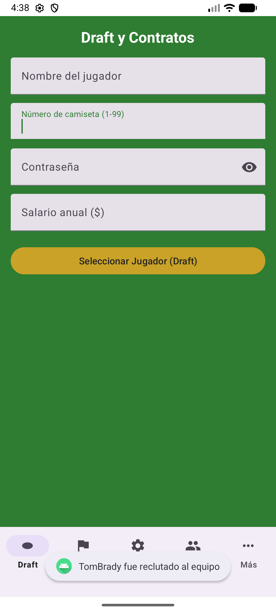 | 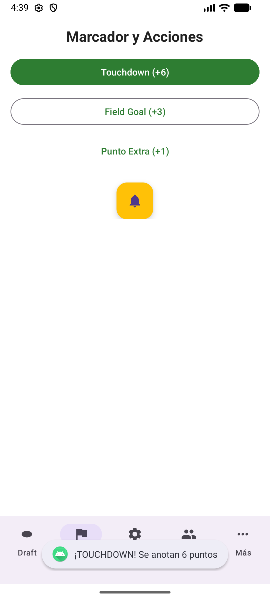 | 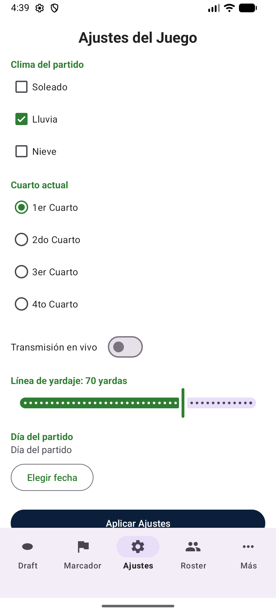 |

| Sección 4: Roster del Equipo | Sección 5: Resumen del Partido | Sección 6: Formaciones |
|---|---|---|
| 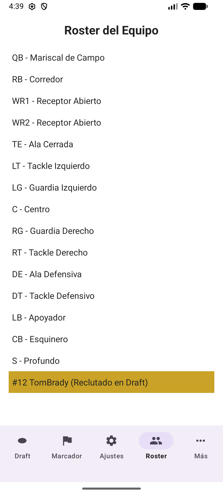 | 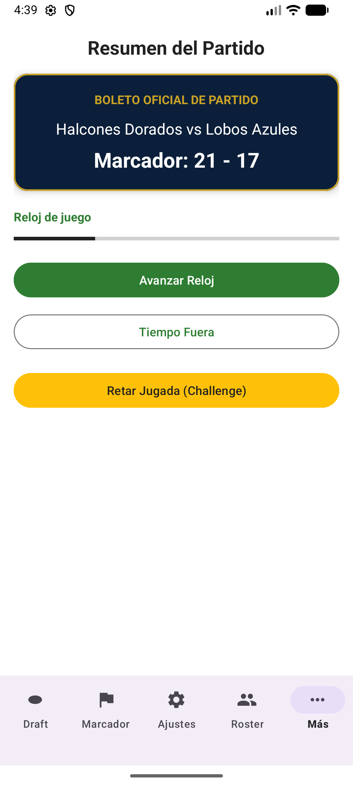 | 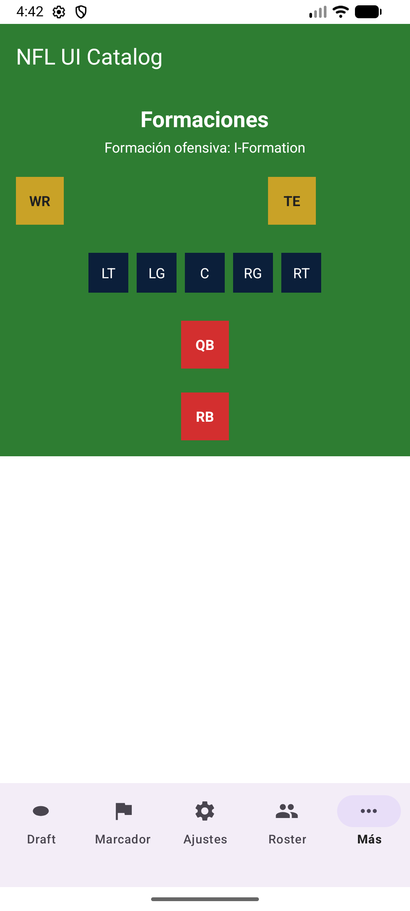 |

### android-compose

| Sección 1: Draft y Contratos | Sección 2: Marcador y Acciones | Sección 3: Ajustes del Juego |
|---|---|---|
| 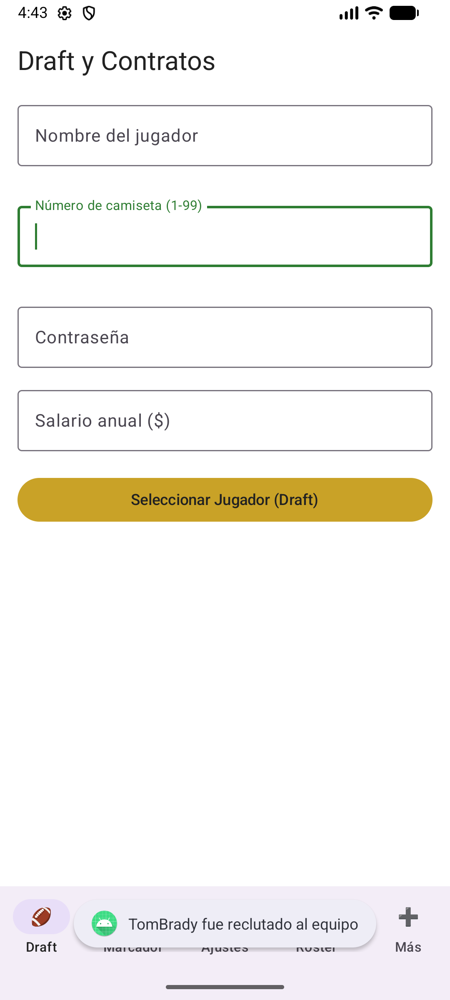 | 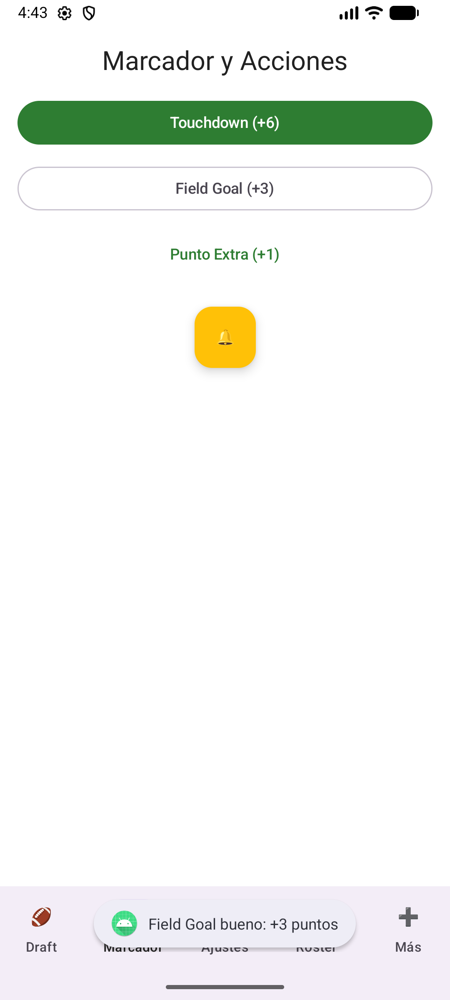 | 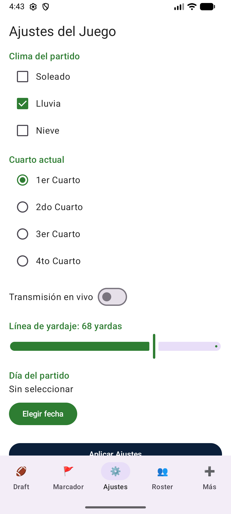 |

| Sección 4: Roster del Equipo | Sección 5: Resumen del Partido | Sección 6: Formaciones |
|---|---|---|
| 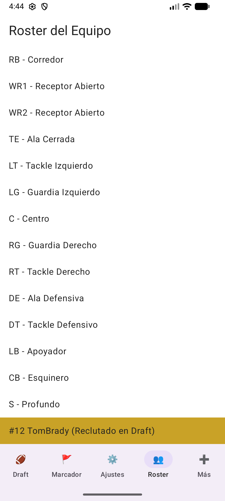 | 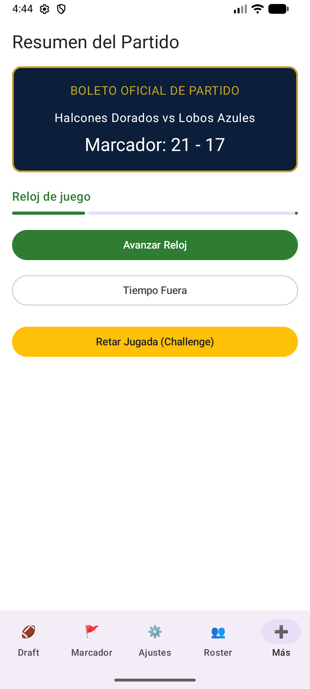 | 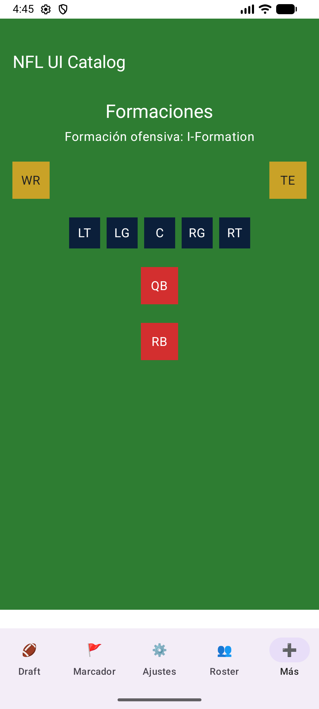 |

### Flutter

| Sección 1: Draft y Contratos | Sección 2: Marcador y Acciones | Sección 3: Ajustes del Juego |
|---|---|---|
| 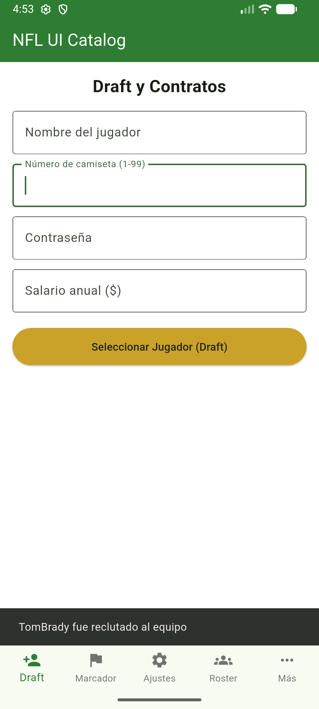 | 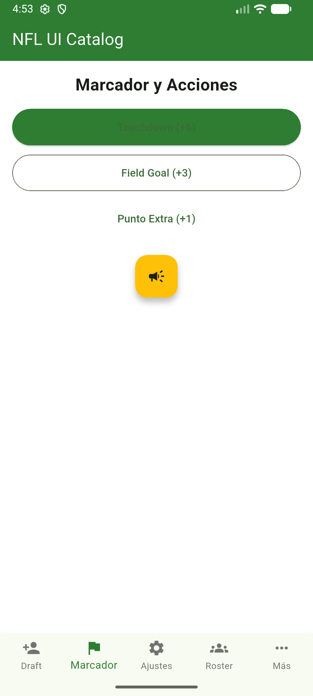 | 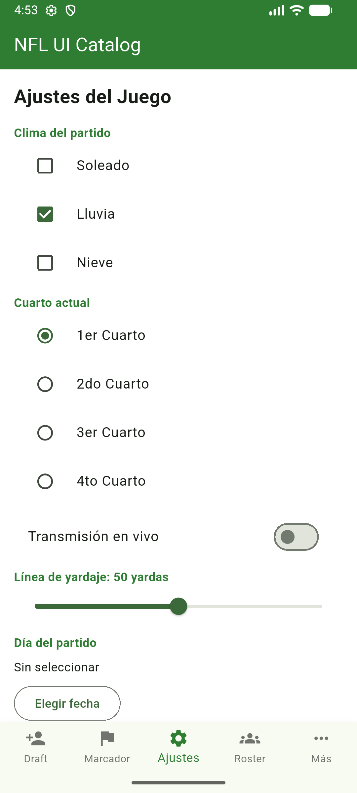 |

| Sección 4: Roster del Equipo | Sección 5: Resumen del Partido | Sección 6: Formaciones |
|---|---|---|
| 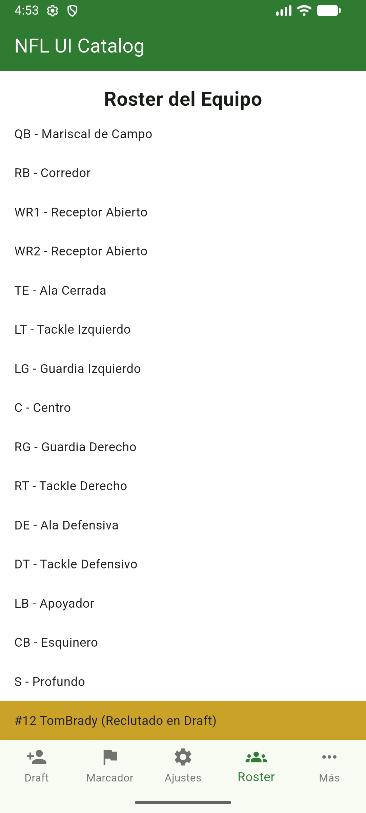 | 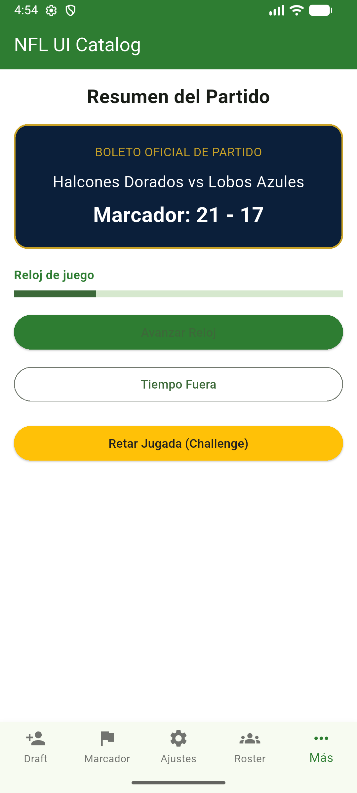 | 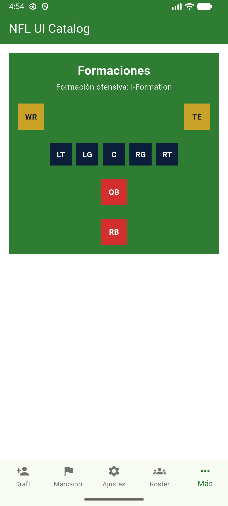 |
